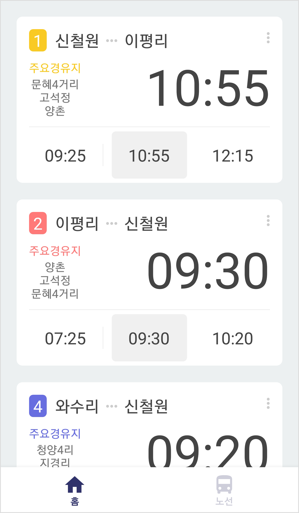
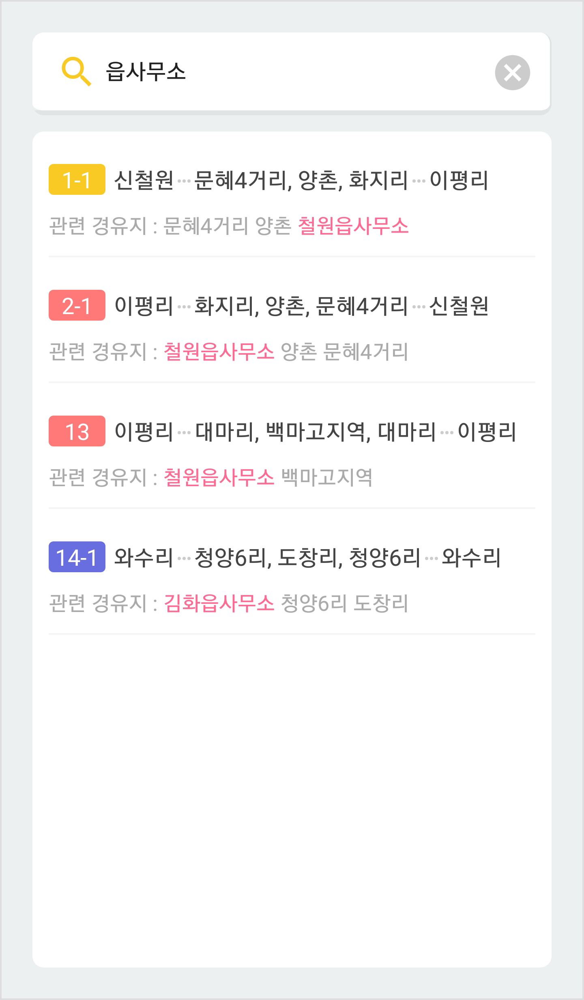
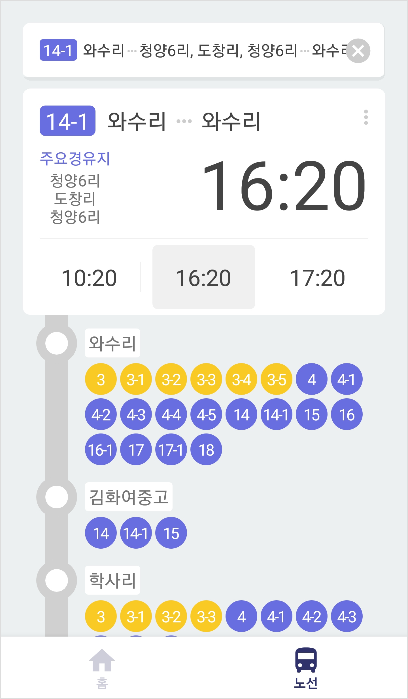

 
<h2 align="center"><b>CWBus</b></h2>
<h4 align="center">Bus Information Application for Cheorwon, Korea</h4>

  

 

## About

CWBus is an application for mobile devices that serves information of public transportation in Cheorwon, Korea.  

Unlike bus information system in other major cities, it provides time information based on a fixed timetable because it has a GPS-less environment. Depending on the characteristics of bus delays in small cities, it is somewhat easier to guess bus arrival information because most of the buses are operated according to a somewhat regular timetable in an environment without traffic.  

For this reason, CWBus aims to provide bus departure-arrival information via fixed timetable in a GPS-less environment.  

This application was originally created by JerryPark and released under the GNU GPLv3.

## Features

The app lets you:
- Know what time bus departs.
- Know the next departure time for the route.
- Search which bus is passing through which bus stop.
- Check quickly the timetables of your favorite buses.
- Needs no special permissions on Android 4.4+.

## Screenshots

## Contributing

CWBus app is a free and open source project developed by volunteers. Any contributions are welcome.

## License

This application is released under GNU GPLv3 (see [LICENSE](LICENSE)).
Some of the used libraries are released under different licenses.